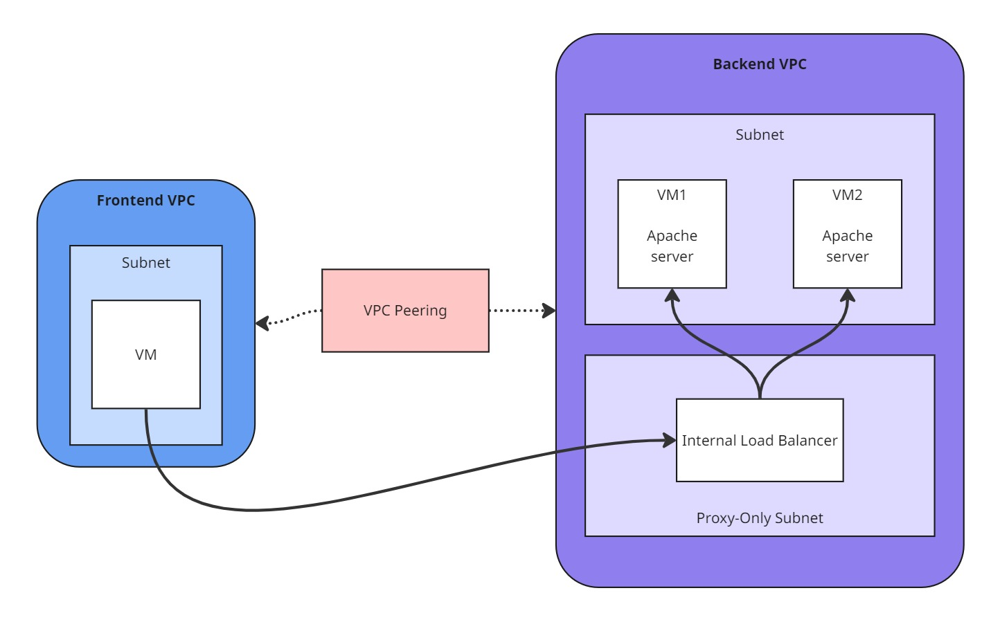
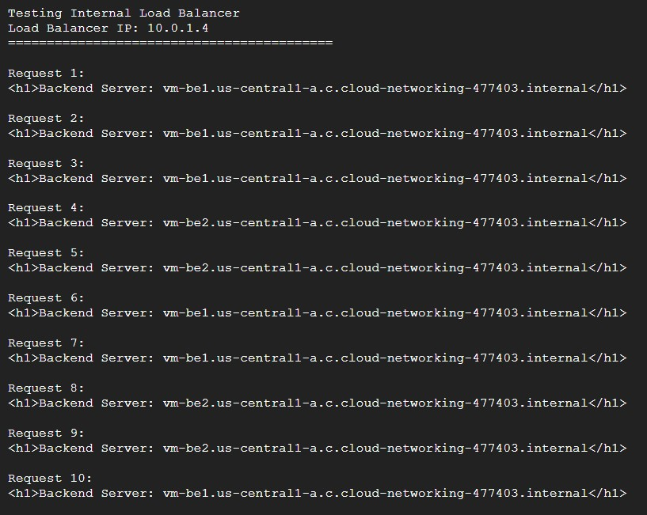

# GCP Internal Load Balancer Demo

This Terraform project demonstrates an internal HTTP load balancer on Google Cloud Platform, distributing traffic between backend VMs across separate VPC networks.

## Architecture



**What it creates:**

- 2 backend VMs running Apache web servers in `vpc-be`
- 1 frontend VM in `vpc-fe` (with public IP for SSH access)
- Internal HTTP Load Balancer (Layer 7) distributing traffic to backend VMs
- VPC peering connecting frontend and backend networks
- Simple test script to demonstrate load balancing

## Prerequisites

1. **GCP Account** with billing enabled
2. **Terraform** installed ([Download](https://www.terraform.io/downloads))
3. **gcloud CLI** installed ([Download](https://cloud.google.com/sdk/docs/install))

## Setup

### 1. Authenticate with GCP

```bash
# Login to GCP
gcloud auth login

# Set your project
gcloud config set project YOUR_PROJECT_ID

# Enable required APIs
gcloud services enable compute.googleapis.com

# Set up credentials for Terraform
gcloud auth application-default login
```

### 2. Configure Provider

Create a `provider.tf` file in the project root:

```hcl
provider "google" {
  project = "YOUR_PROJECT_ID"
  region  = "us-central1"
}
```

Replace `YOUR_PROJECT_ID` with your actual GCP project ID.

### 3. Deploy Infrastructure

```bash
# Initialize Terraform
terraform init

# Preview changes
terraform plan

# Deploy (takes 3-5 minutes)
terraform apply
```

Type `yes` when prompted.

## Test the Load Balancer

After deployment completes, Terraform will show you instructions. Here's how to test:

```bash
# SSH into the frontend VM
gcloud compute ssh vm-fe --zone=us-central1-a

# Run the test script
sudo /root/test-lb.sh
```

You'll see 10 requests going through the load balancer, with responses alternating between `vm-be1` and `vm-be2`.



## Clean Up

**Important:** To avoid ongoing charges, destroy all resources when done:

```bash
terraform destroy
```

Type `yes` to confirm.

## How It Works

1. **Backend VMs** run Apache web servers showing their hostname
2. **VPC Peering** allows frontend VM to communicate with backend network
3. **Frontend VM** makes HTTP requests to the **Internal Load Balancer** IP
4. **Load Balancer** distributes requests between vm-be1 and vm-be2
5. **Each response** shows which backend VM handled the request

The internal load balancer is Layer 7 (HTTP-aware) and only accessible from within the VPC networks.
